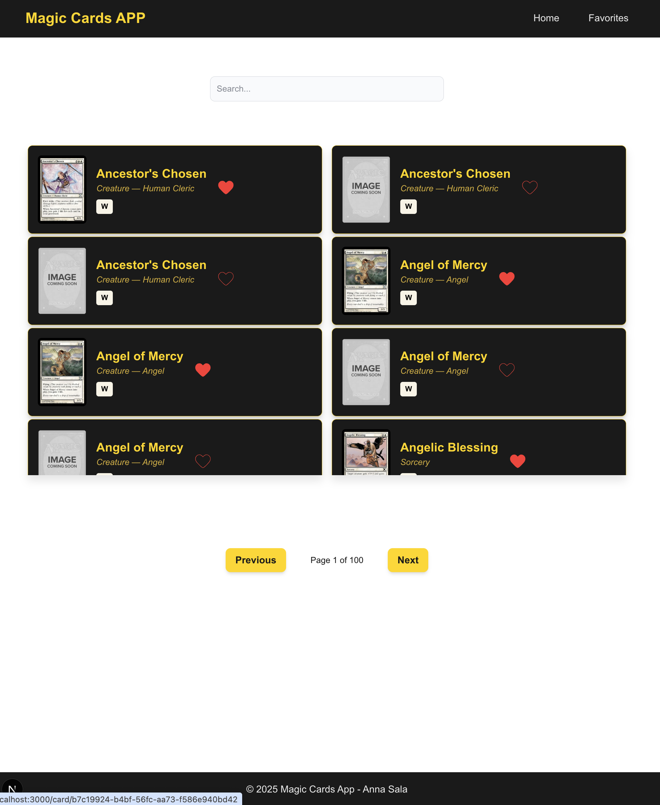
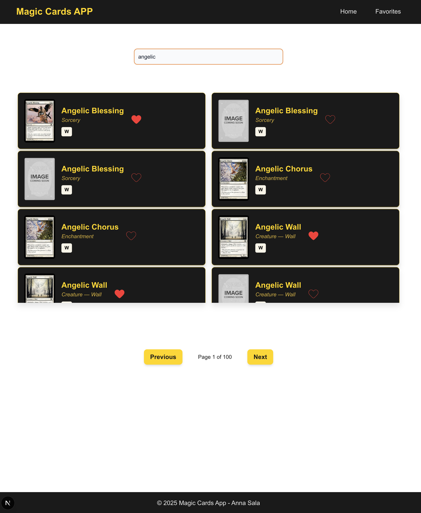
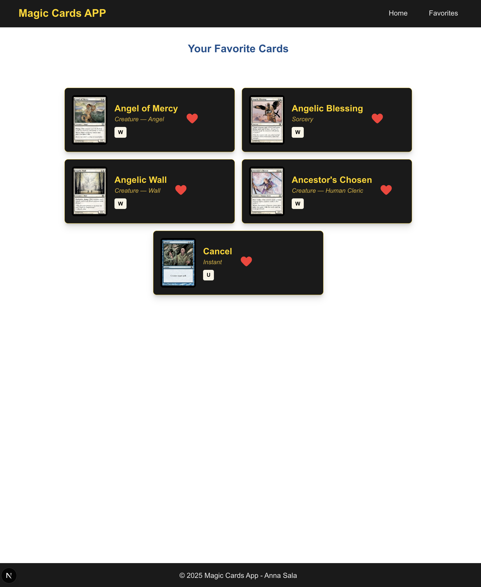
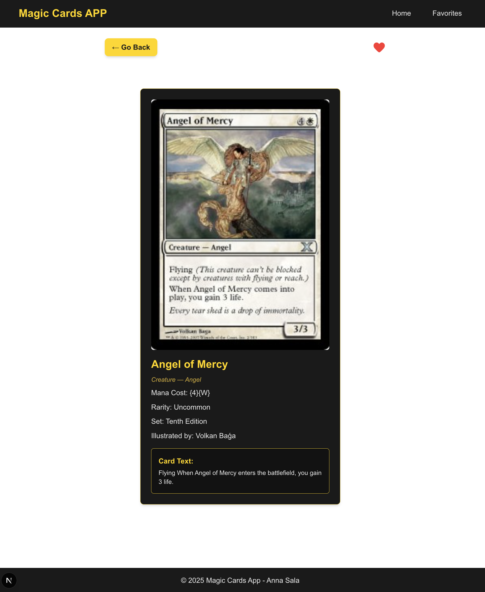

This is a [Next.js](https://nextjs.org) project bootstrapped with [`create-next-app`](https://nextjs.org/docs/app/api-reference/cli/create-next-app).

## System requirements

To run this code in your system, it must satisfy the next minimum requirements:

- NodeJS 18.18 or later
- npm 9 or later

## Install modules

`npm install`

## Commands guide

to run application:

`npm start`

To tun test:

`npm test`

## Features implemented

- View all the Magic Cards on a paginated list.
- Search for Magic Cards by name through the use of a search bar.
- View Magic Cards details.
- Add Cards to Favorites
- View Favorites List

Other implementations:

- Virtualized grid with responsive adaptation.
- Deployment ready with Docker.
- Debounced search when filtering.

## App Screenshots

